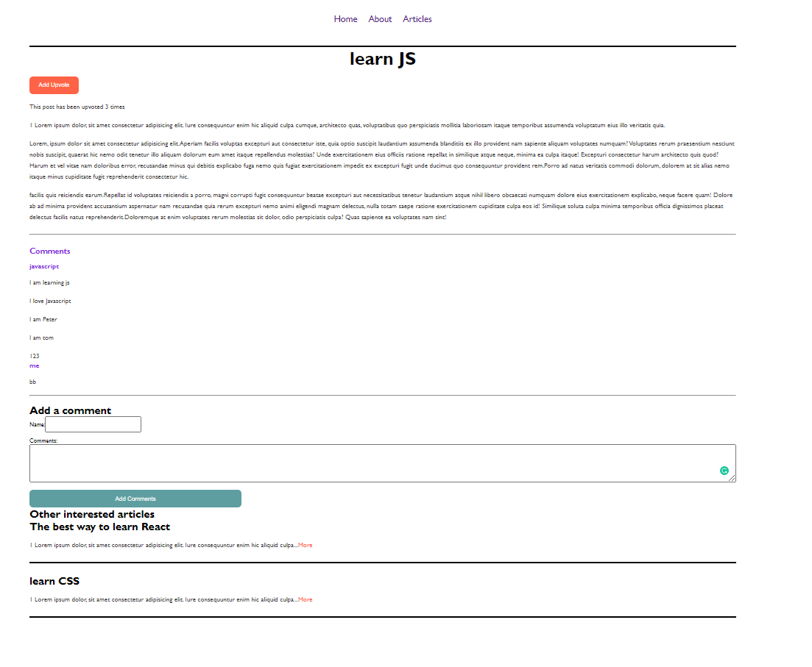
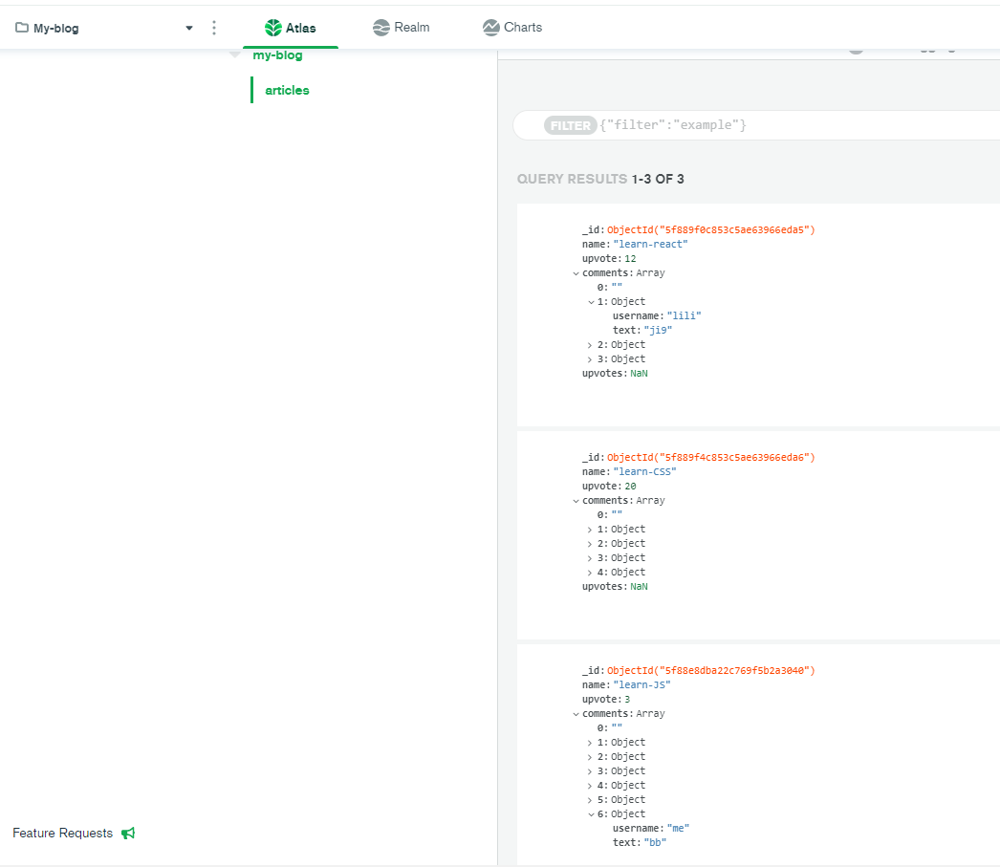

#FullStack-article-app

Shijing Liu 2020-10-15

react hooks, UseState, UseEffect, Router, Mongodb, express, AWS

frontend folder: my-blog backend folder: my-blog-backend

functions:
Can add vote,
add comment,
navigate to different artiles from article list page.
Can navigate to other interest articles.

All css in app.css folder.

CORS issue fix: In frontend packege.json Add: "proxy":"http://localhost:8000",

Backend needs to use npm install babel, frontend npx create-react-app helps doing it.

Backend:8000 and frontend:3000 both use npm start

